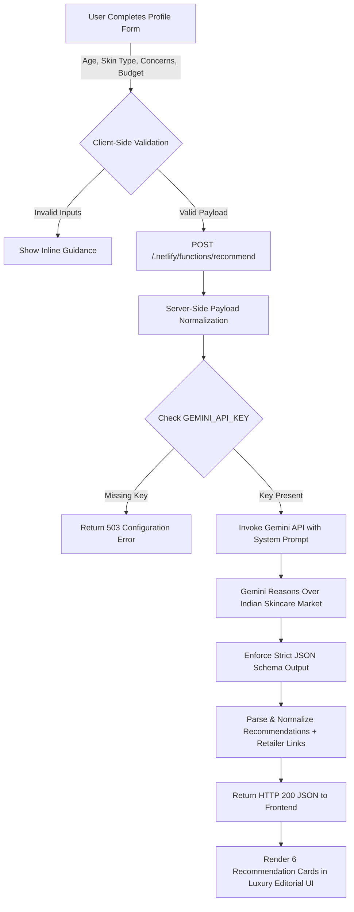
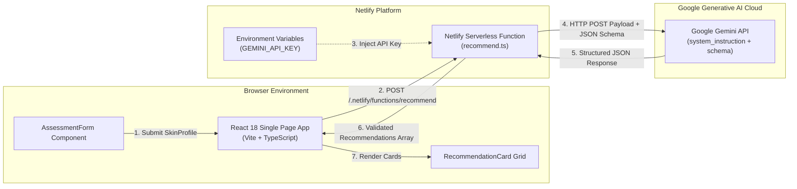

<div align="center">

# SkinTwin

***Your skin. Your twin. Your routine.***

A thoughtful, AI-powered skincare consultation engine that transforms overwhelming options into six perfectly tailored, budget-aware product recommendations for the Indian market.

[](https://react.dev/)
[](https://www.typescriptlang.org/)
[](https://vitejs.dev/)
[](https://tailwindcss.com/)
[](https://www.netlify.com/products/functions/)
[](https://ai.google.dev/)

[**Explore Live Application**](https://skintwin0.netlify.app/) &nbsp;•&nbsp; [**View Documentation**](./docs/PROJECT.md) &nbsp;•&nbsp; [**Architecture Overview**](#-architecture)

---

</div>

## 📌 Overview

**SkinTwin** solves skincare discovery paralysis. Rather than forcing users to navigate thousands of sponsored product catalog listings or complete lengthy quizzes behind mandatory account signups, SkinTwin delivers instant, personalized product recommendations powered by **Google Gemini** reasoning.

Users specify their age bracket, skin type, active concerns (or choose *No Specific Concern*), sensitivity tolerance, desired product category, and target budget in **INR (₹)**. SkinTwin processes these inputs through a secure, serverless Netlify Function and returns **six curated recommendations** with detailed reasoning and multi-retailer purchase links (Official Store, Nykaa, Amazon India).

```
"I have oily, sensitive skin and need a non-comedogenic sunscreen under ₹700."
                 │
                 ▼
     [ SkinTwin Engine ]
                 │
                 ▼
  6 Indian market matches + specific active ingredient reasoning + purchase links
```

---

## 🖼️ Project Preview

> [!NOTE]
> Below are interface previews showcasing SkinTwin's editorial luxury aesthetic, single-screen consultation form, and recommendations grid.

<div align="center">

```
┌───────────────────────────────────────────────────────────────────────────┐
│                                                                           │
│   SKINTWIN                          Your skin. Your twin. Your routine.   │
│ ───────────────────────────────────────────────────────────────────────── │
│                                                                           │
│               Personalized skincare, thoughtfully curated.               │
│     Describe your skin profile, active concerns, and budget. We curate    │
│       six targeted product recommendations tailored to your routine.      │
│                                                                           │
│   AGE GROUP              SKIN TYPE                TARGET BUDGET           │
│   [ 18–24 ] [ 25–34 ]    [ Oily ] [ Combination ] [ ₹  1,500          ] │
│                                                                           │
│   SKIN CONCERNS                                   PRODUCT CATEGORY        │
│   ( Acne ) ( Dark Spots ) ( No Specific Concern ) [ Sunscreen ]           │
│                                                                           │
│                   [ Generate Recommendation → ]                           │
│                                                                           │
└───────────────────────────────────────────────────────────────────────────┘
```

<br/>

```
┌───────────────────────────────────────────────────────────────────────────┐
│                                                                           │
│  MINIMALIST                             RE'EQUIL                          │
│  ₹399                                   ₹695                              │
│  Fluid Sunscreen SPF 50                 Ultra Matte Dry Touch Sunscreen   │
│  Sunscreen                              Sunscreen                         │
│                                                                           │
│  Active composition:                    Active composition:               │
│  Primary UV filters with Niacinamide    Advanced UV filters with Tocopherol │
│                                                                           │
│  WHY WE RECOMMEND IT                    WHY WE RECOMMEND IT               │
│  Lightweight fluid formula that won't   Silicone-based matte finish ideal │
│  clog pores for 18–24 oily skin.        for humid climate oil control.    │
│                                                                           │
│  Available at:                          Available at:                     │
│  [ Official Store ↗ ] [ Nykaa ↗ ]       [ Official Store ↗ ] [ Nykaa ↗ ]  │
│                                                                           │
└───────────────────────────────────────────────────────────────────────────┘
```

</div>

---

## 💡 Why SkinTwin

### The Problem
1. **Catalog Overwhelm**: Finding skincare in India means sifting through hundreds of brands with conflicting ingredient marketing.
2. **Sponsored Quiz Bias**: Traditional recommendation quizzes push hardcoded sponsored products regardless of actual ingredient suitability.
3. **Budget Mismatch**: International tools suggest products inaccessible or overpriced in local markets.
4. **Friction**: Mandatory signups, personal data collection, and multi-page forms cause high drop-off rates.

### SkinTwin's Approach
- **Zero Sponsored Catalog**: Gemini reasons dynamically over the entire Indian skincare market (Minimalist, Derma Co, Re'equil, Dot & Key, Cetaphil, Neutrogena, Simple, etc.).
- **Strict Constraint Adherence**: If you request a sunscreen under ₹500 for sensitive skin, every recommendation respects all three conditions.
- **First-Class "No Specific Concern" Support**: Simplifying discovery for users who just want a solid daily cleanser or moisturizer without over-treating their skin.
- **Privacy First**: No user database, no signups, no analytics tracking, no state saved across sessions.

---

## ⚙️ How It Works



---

## ✨ Core Features

- **Personalized Consultation Form**: Single-screen intuitive inputs for age bracket, skin type, concerns, sensitivity/feel, category, and budget.
- **Specific & Free-Text Product Search**: Choose standard categories (*Sunscreen, Serum, Cleanser, Moisturizer, Toner, Face Mask*) or enter custom requirements (*e.g., "Non-comedogenic barrier repair cream"*).
- **INR (₹) Budget Control**: Precise numeric input with real-time upper boundary enforcement (up to ₹50,000).
- **"No Specific Concern" Support**: First-class handling for simplified maintenance routines.
- **Multi-Model Fallback System**: Serverless backend tries Gemini models sequentially (`gemini-flash-lite-latest`, `gemini-3.8-flash`, `gemini-3.7-flash`, etc.) for zero downtime during API spikes.
- **Multi-Retailer Direct Buying Links**: Every card automatically generates deep links to the brand's Official Store, Nykaa, and Amazon India.
- **Luxury Editorial Aesthetic**: Custom typography hierarchy, soothing cream/sage palette, high whitespace ratio, and quiet design confidence.
- **Zero Frontend Secret Exposure**: Gemini API key is isolated on the serverless layer.

---

## 🧪 Example Use Cases

| Target Need | User Inputs | SkinTwin Output Focus |
|---|---|---|
| **Budget Sunscreen** | Oily Skin • Combination • Sunscreen • Budget: ₹700 | Ultra-light, non-greasy matte sunscreens (e.g., Re'equil, Minimalist, Aqualogica) |
| **Sensitive Barrier Repair** | Dry / Sensitive • Dryness • Moisturizer • Budget: ₹1,500 | Ceramide & Cica infused rich creams (e.g., Cetaphil, Dot & Key, Formula RX) |
| **Acne & Oil Control** | 18–24 • Oily • Acne + Pimples • Foaming Cleanser • Budget: ₹500 | Salicylic Acid foaming cleansers (e.g., Derma Co, Minimalist, Simple) |
| **Simple Routine (No Concern)** | 25–34 • Normal • No Specific Concern • Daily Serum • Budget: ₹1,000 | Hydrating & antioxidant maintenance serums (e.g., Vitamin C, Hyaluronic Acid) |

---

## 🏗️ Architecture

SkinTwin uses a clean, decoupled serverless architecture separating client rendering from generative AI processing:



---

## 🛠️ Technical Stack

| Layer | Technology | Version | Purpose |
|---|---|---|---|
| **Frontend Framework** | [React](https://react.dev/) | `^18.3.1` | UI component tree and local application state management |
| **Language** | [TypeScript](https://www.typescriptlang.org/) | `^5.7.3` | End-to-end static type safety for profiles and API payloads |
| **Build Tool & Server** | [Vite](https://vitejs.dev/) | `^6.1.0` | Blazing fast client bundling and HMR development server |
| **Styling** | [Tailwind CSS](https://tailwindcss.com/) | `^3.4.17` | Utility-first responsive styling and brand palette design |
| **Icons** | [Lucide React](https://lucide.dev/) | `^0.475.0` | Minimal vector icons (`ArrowUpRight`, `AlertCircle`, etc.) |
| **Serverless Runtime** | [Netlify Functions](https://www.netlify.com/products/functions/) | `^2.8.2` | Secure backend proxy executing Node.js serverless functions |
| **AI Engine** | [Google Gemini API](https://ai.google.dev/) | REST v1beta | Generative AI reasoning over Indian skincare product data |
| **Deployment** | [Netlify](https://www.netlify.com/) | Native | Production static asset hosting and function deployment |

---

## 🔄 Request / Response Flow

```
[Browser]                          [Netlify Function]                          [Gemini API]
   │                                       │                                        │
   │─── 1. POST SkinProfile ──────────────>│                                        │
   │    { skinType, concerns, budget... }  │                                        │
   │                                       │─── 2. Validate Profile Payload ───────>│
   │                                       │                                        │
   │                                       │─── 3. Construct System Prompt ─────────>│
   │                                       │    & JSON Response Schema              │
   │                                       │                                        │
   │                                       │─── 4. POST /generateContent ──────────>│
   │                                       │                                        │
   │                                       │<── 5. Raw JSON Response ───────────────│
   │                                       │                                        │
   │                                       │─── 6. Clean & Parse JSON Code Fences   │
   │                                       │─── 7. Attach Nykaa / Amazon Links      │
   │                                       │                                        │
   │<── 8. Return Normalized Array ────────│                                        │
   │    { recommendations: [...] }         │                                        │
   │                                       │                                        │
```

### Server-Side Recommendation Normalization Logic
Inside `netlify/functions/recommend.ts`, raw AI output undergoes structural validation prior to reaching the browser:

```typescript
// Excerpt from netlify/functions/recommend.ts
interface Recommendation {
  productName: string;
  brand: string;
  productType: string;
  price: string | null;
  keyInfo: string;
  reasoning: string;
  link: string | null;
  links: ProductLink[];
}
```

---

## 🔒 Security & Privacy

- **Server-Side API Key Isolation**: `GEMINI_API_KEY` is referenced strictly within `netlify/functions/recommend.ts`. It is never exposed in client bundles, DOM nodes, or network calls from the browser.
- **Stateless Operation**: No user data, IP addresses, or skin consultations are logged or stored in any database.
- **Strict Input Bounds**: Server-side validation restricts budget input to range `(0, 50000]` INR and sanitizes string inputs against payload injection.
- **Environment Isolation**: `.env` is included in `.gitignore` to prevent secret commits. `.env.example` provides safe templates for local setups.

---

## 🧠 AI Recommendation Philosophy & Disclaimer

SkinTwin leverages LLM reasoning to match complex multi-variable constraints (skin type + sensitivity + specific ingredients + budget) without relying on rigid SQL filtering or outdated product catalogs.

> [!IMPORTANT]
> **Medical Disclaimer**: SkinTwin is an AI-powered discovery consultation engine, **not a medical diagnosis tool**. It does not diagnose dermatological conditions or prescribe medical treatments. 

> [!TIP]
> **Consumer Verification Notice**: Product formulations, prices, retailer links, and availability in the Indian market fluctuate dynamically. Users should always check actual product ingredients, verify current prices, and perform a patch test before integrating any new product into their daily routine.

---

## 📁 Project Structure

```
SkinTwin/
├── netlify/
│   └── functions/
│       └── recommend.ts          # Serverless handler, Gemini API proxy & JSON parser
├── src/
│   ├── components/
│   │   ├── AssessmentForm.tsx    # Controlled multi-section consultation form
│   │   ├── BudgetInput.tsx       # INR currency input with bounds validation
│   │   ├── ChipSelect.tsx        # Accessible option chip selector
│   │   ├── Disclaimer.tsx        # Persistent non-intrusive medical notice
│   │   ├── ErrorState.tsx        # Friendly retry and error notification card
│   │   ├── LoadingState.tsx      # Editorial phrase cycler during AI generation
│   │   ├── RecommendationCard.tsx# Product display card with multi-retailer links
│   │   └── ResultsList.tsx       # Grid display & preference modification CTA
│   ├── lib/
│   │   └── api.ts                # Client fetch interface for Netlify serverless route
│   ├── styles/
│   │   └── index.css             # Tailwind base styles and custom theme variables
│   ├── types/
│   │   └── skintwin.ts           # Shared TypeScript interfaces and constant arrays
│   ├── App.tsx                   # Top-level state orchestration
│   └── main.tsx                  # React DOM entrypoint
├── docs/
│   ├── BUILD.md                  # Verification and build guidelines
│   ├── DESIGN.md                 # Design system specifications and palette tokens
│   ├── PROJECT.md                # Requirements and product spec
│   └── TECHNICAL.md              # Backend and technical architecture details
├── public/
│   └── robots.txt                # Search engine crawler configuration
├── .env.example                  # Environment variable reference template
├── .gitignore                    # Git tracking exclusions
├── index.html                    # Root HTML file
├── netlify.toml                  # Netlify build and function routing configuration
├── package.json                  # Dependencies and execution scripts
├── postcss.config.js             # PostCSS processing config
├── tailwind.config.ts            # Tailwind custom colors and typography extension
├── tsconfig.json                 # Strict TypeScript configuration
└── vite.config.ts                # Vite build and plugin setup
```

---

## 🚀 Getting Started

Follow these steps to run SkinTwin locally on your machine.

### 1. Prerequisites
- **Node.js**: `v18.0.0` or higher
- **npm**: `v9.0.0` or higher
- **Gemini API Key**: Obtain a free API key from [Google AI Studio](https://aistudio.google.com/).

### 2. Clone & Install
```bash
# Clone repository
git clone https://github.com/brijeshearn12-dotcom/SkinTwin.git

# Navigate to project directory
cd SkinTwin

# Install dependencies
npm install
```

### 3. Configure Environment
Create a `.env` file in the project root:

```bash
cp .env.example .env
```

Add your Gemini API key:
```env
GEMINI_API_KEY=your_actual_gemini_api_key_here
```

### 4. Run Locally

#### Option A: Vite Local Server (Frontend only UI testing)
```bash
npm run dev
```
*Note: Directly fetching backend functions requires Netlify CLI proxying (Option B).*

#### Option B: Netlify CLI (Full serverless function & AI recommendations test)
```bash
# Install Netlify CLI globally if not installed
npm install -g netlify-cli

# Start local server with serverless functions proxied
netlify dev
```
Open `http://localhost:8888` in your browser.

---

## ⚙️ Environment Variables

| Variable Name | Environment | Required | Description |
|---|---|---|---|
| `GEMINI_API_KEY` | Serverless runtime only | **Yes** | Google AI Studio API key used by `netlify/functions/recommend.ts`. |

> [!CAUTION]
> Never commit `.env` or hardcode your `GEMINI_API_KEY` into frontend files.

---

## ☁️ Netlify Deployment

SkinTwin is pre-configured for automated continuous deployment on Netlify using `netlify.toml`:

```toml
[build]
  command = "npm run build"
  publish = "dist"
  functions = "netlify/functions"

[[redirects]]
  from = "/api/*"
  to = "/.netlify/functions/:splat"
  status = 200
```

### Deployment Steps:
1. Push your repository to GitHub.
2. Log into [Netlify](https://app.netlify.com/) and choose **Import an existing project**.
3. Select your repository. Netlify automatically detects build settings from `netlify.toml`.
4. Navigate to **Site Settings > Environment Variables** and add:
   - **Key**: `GEMINI_API_KEY`
   - **Value**: `[Your Google AI Studio API Key]`
5. Click **Deploy Site**.

---

## 🧪 Testing & Verification

Verify TypeScript compliance and production asset compilation using the repository's native scripts:

```bash
# Typecheck TypeScript files and create production build
npm run build

# Preview production build locally
npm run preview
```

### Code Quality Verification Matrix
- **Type Safety**: Zero TypeScript compilation errors (`tsc`).
- **Build Output**: Clean Vite bundle emitted to `dist/`.
- **Form Integrity**: Submission disabled if required chips or budget are empty.
- **Graceful Error Handling**: 502/Network failures render friendly UI with a working retry trigger.

---

## 🎨 Design System

SkinTwin follows an editorial skincare aesthetic inspired by boutique skincare labels.

### Color Palette

| Token | Hex | Role | Visual Preview |
|---|---|---|---|
| **Cream** | `#FAF7F0` | Main canvas background |  `#FAF7F0` |
| **White** | `#FFFFFF` | Recommendation card surface |  `#FFFFFF` |
| **Dark Olive** | `#384238` | Headings, primary text, dark CTA |  `#384238` |
| **Sage** | `#A8BFA3` | Borders, chip backgrounds, accents |  `#A8BFA3` |
| **Dusty Peach** | `#E8B7A5` | Warm highlight accents & hover states |  `#E8B7A5` |
| **Muted Olive** | `#6B776A` | Subtitles and meta labels |  `#6B776A` |

### Typography & Spacing
- **Serif Font**: High-contrast editorial serif used for headers and product names (`font-serif`).
- **Sans-Serif Font**: Clean, legibility-first sans-serif for controls, chips, and body text (`font-sans`).
- **Base Grid**: 8px spatial unit with maximum form width constrained to `672px` (`max-w-2xl`).

---

## ⚠️ Limitations

- **Dynamic Retail Pricing**: AI-estimated prices in INR may differ slightly from flash sales or retailer discounts.
- **Search Link Redirects**: Multi-retailer links open search queries directly on official brand stores, Nykaa, or Amazon India.
- **API Availability**: Generative responses rely on Google Gemini API uptime; serverless model fallbacks are integrated to maximize reliability.

---

## 🚫 What SkinTwin Deliberately Does NOT Do

To maintain a lean, private, and frictionless experience, SkinTwin intentionally excludes:

- ❌ **No User Accounts / Auth**: No passwords, OAuth, or personal data harvesting.
- ❌ **No Hardcoded Product Database**: No static tables requiring manual inventory updates.
- ❌ **No Face Scanning / AI Camera**: No invasive computer vision or camera access permissions.
- ❌ **No Medical Diagnoses**: No treatment claims for severe skin pathologies.
- ❌ **No E-Commerce Cart / Checkout**: No payment gateways; direct link-outs to established retailers only.
- ❌ **No Affiliate Link Manipulation**: Search links are generated purely for user convenience.

---

## 🔮 Future Improvements

Planned non-breaking enhancements for future releases:

- [ ] **Routine Sequencer**: Group recommended products into AM/PM step-by-step application order.
- [ ] **PDF / Image Export**: Download personalized consultation summaries as formatted digital routine cards.
- [ ] **Ingredient Exclusions**: Filter out specific sensitive additives (*e.g., Essential Oils, Artificial Fragrance, Niacinamide*).
- [ ] **Multi-Currency Support**: Expand budget selection to regional currencies ($ USD, € EUR, £ GBP).

---

## 🤝 Contributing

Contributions are welcome! If you'd like to improve SkinTwin:

1. Fork the Repository.
2. Create a Feature Branch: `git checkout -b feature/amazing-feature`.
3. Commit Changes: `git commit -m 'feat: add amazing feature'`.
4. Push to Branch: `git push origin feature/amazing-feature`.
5. Open a Pull Request.

---

## 📄 License

This project is licensed under the **MIT License**. See the [LICENSE](LICENSE) file for details.

---

## 🙏 Acknowledgements

- **Google Gemini AI**: Generative reasoning model powers recommendations.
- **Netlify**: Serverless function environment and continuous hosting platform.
- **Lucide Icons**: Clean, lightweight UI icons.
- **Tailwind CSS**: Utility-first styling framework.

---

<div align="center">

**Experience SkinTwin Today**

[**Launch Application →**](https://skintwin0.netlify.app/)

*Crafted with care for simple, confident skincare discovery.*

</div>
